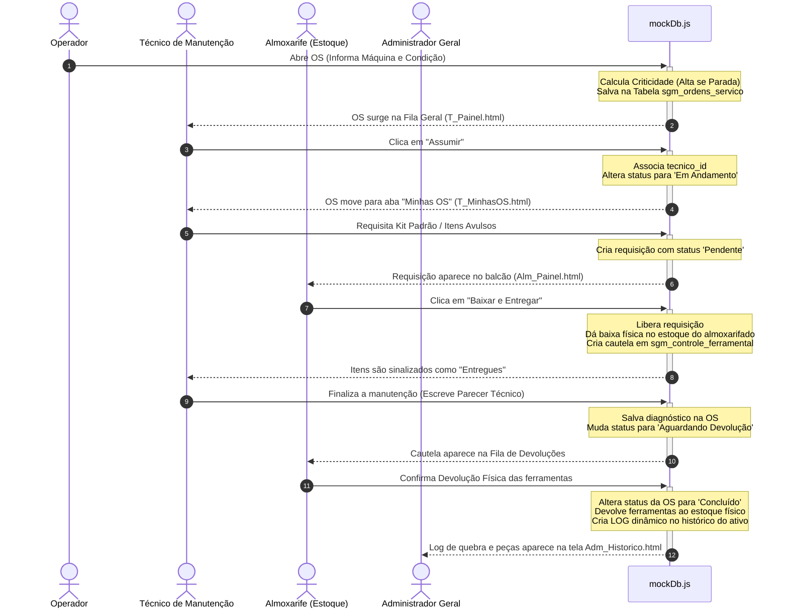

# Sistema de Gerenciamento de Manutenção (SGM) - Dilly Sports
### CE Wanderillo de Castro Câmara (Brejo Santo - CE)

Este projeto consiste em um protótipo de alta fidelidade e totalmente funcional para o **Sistema de Gerenciamento de Manutenção (SGM)** da fábrica **Dilly Sports**. O sistema integra as quatro principais visões de controle industrial: **Operador (Chão de Fábrica)**, **Técnico de Manutenção**, **Almoxarifado** e **Administrador Geral**.

Para contornar as limitações físicas de rede local e servidores da fábrica (conforme detalhado no arquivo `ideia.md`), este sistema foi desenvolvido inteiramente em **HTML, CSS e JavaScript puros**, utilizando o **LocalStorage** do navegador como motor de banco de dados simulado (Mock DB). Isso garante que o sistema funcione 100% offline, mantendo a reatividade dos dados entre as abas em tempo real!

---

## 📋 Sumário de Requisitos do Projeto

O sistema foi desenhado para resolver as seguintes problemáticas identificadas no chão de fábrica:
1. **Rastreabilidade e Fila Única:** Um painel reativo central onde novos chamados são listados e técnicos podem assumir ordens de serviço.
2. **Priorização Automatizada:** Cálculo automático de criticidade com base na condição física relatada da máquina (Parada = Alta/Crítica; Restrição = Média/Alerta).
3. **Gestão de Inventário e Cautelas:** Baixa física de saldo de estoque no balcão do Almoxarifado para peças de reposição e controle de devolução de ferramentas/kits ao final do serviço.
4. **Histórico Cronológico das Máquinas:** Logs de manutenção inseridos de forma autônoma após a entrega de ferramentas ao Almoxarifado.

---

## 🛠️ Arquitetura e Estrutura de Banco de Dados (`mockDb.js`)

O arquivo [mockDb.js](file:///C:/Users/Gusstavo%20Tucci/Documents/pi%20ryan/Projeto-SGM/mockDb.js) atua como o motor relacional local. Ele mapeia e gerencia as tabelas no `localStorage` sob o prefixo `sgm_`.

### Estruturação das Tabelas e localStorage Keys

| Tabela Relacional | localStorage Key | Descrição do Conteúdo |
| :--- | :--- | :--- |
| `usuarios` | `sgm_usuarios` | Login, Matrícula, Senha, Cargo (Administrador, Almoxarife, Técnico, Operador). |
| `equipamentos` | `sgm_equipamentos` | Cadastro de ativos industriais, setor e status operacional. |
| `itens_almoxarifado` | `sgm_itens_almoxarifado` | Inventário de Peças de Reposição e Ferramentas com Qtd Mínima de Alerta. |
| `kits_padrao` | `sgm_kits_padrao` | Relação de ferramentas padrões criadas pela engenharia. |
| `ordens_servico` | `sgm_ordens_servico` | Controle e histórico das Ordens de Serviço (OS) com criticidade e pareceres. |
| `requisicoes_materiais` | `sgm_requisicoes_materiais` | Carrinho de requisições de técnicos pendentes de aprovação pelo Almoxarife. |
| `controle_ferramental` | `sgm_controle_ferramental` | Registro de cautelas/empréstimos ativos e devolução física de ferramentas. |
| `historico_maquinas` | `sgm_historico_maquinas` | Cronologia de quebras e intervenções registradas para cada ativo. |

---

## 🔄 Fluxo de Trabalho Integrado e Reativo

O diagrama abaixo ilustra como as informações trafegam pelo sistema, conectando as quatro telas em um ciclo de vida contínuo de uma Ordem de Serviço:

---

## 🚀 Como Executar e Testar o Sistema Localmente

Como o projeto é construído em código front-end puro, o SGM **não requer nenhuma instalação de banco de dados local ou servidor web** para rodar.

1. **Abrir a Tela de Login:**
   - Dê um duplo clique no arquivo [login.html](file:///C:/Users/Gusstavo%20Tucci/Documents/pi%20ryan/Projeto-SGM/login.html) a partir de qualquer navegador web.
2. **Logins Padrões de Teste (bd.md):**
   - **Administrador:** Matrícula: `1001` ou Email: `admin@fabrica.com` | Senha: `123456`
   - **Técnico:** Matrícula: `2001` ou Email: `carlos@fabrica.com` | Senha: `senha123`
   - **Almoxarifado:** Matrícula: `3001` ou Email: `marcos@fabrica.com` | Senha: `senha123`
   - **Operador:** Matrícula: `4001` ou Email: `wanderillo@fabrica.com` | Senha: `senha123`

---

## 🛠️ Painel Flutuante de Desenvolvimento (DevHUD)

Durante a navegação por qualquer uma das telas internas, um **painel flutuante** elegante e discreto (estilo glassmorphism) aparecerá no canto inferior direito. Ele foi projetado especificamente para auxiliar nos testes locais do projeto:

- **Alternar Perfil Rápido:** Mude instantaneamente entre os perfis (Administrador, Técnico, Almoxarife e Operador) com apenas um clique, sem precisar fazer logout e passar pela tela de login novamente.
- **Inspecionar Banco de Dados:** Abre um modal em tela que mostra a visualização estruturada em JSON de todas as tabelas salvas no LocalStorage em tempo real.
- **Resetar Banco de Dados:** Limpa todas as modificações realizadas nas tabelas e restaura os dados iniciais originais de fábrica para novos testes.

---

## 📝 Licença e Informações Institucionais
Este projeto faz parte da grade profissionalizante da escola **(CE) Centro de Formação Profissional Wanderillo de Castro Câmara** para a empresa **Dilly Sports** (vigência 2026-2028).
